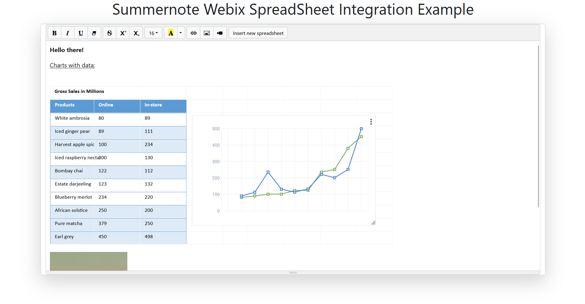
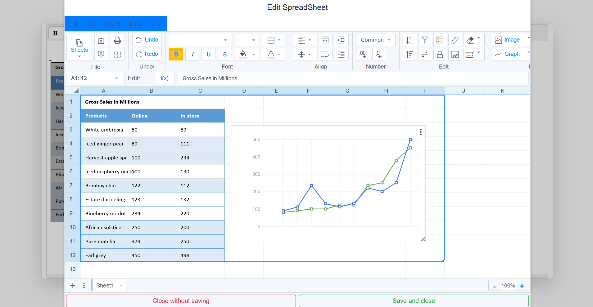

# Summernote Webix Spreadsheet Integration

This plugin extends Summernote by integrating the Webix Spreadsheet widget, allowing users to work with
spreadsheets directly within the Summernote editor. With this plugin, you can seamlessly manage spreadsheet data,
create visual snapshots of specific cell ranges to add them as images to your Summernote content.

## Features

- **Spreadsheet Modal**: Opens a fully interactive spreadsheet modal from a custom button in the Summernote toolbar,
  allowing users to edit and format cells with Webix Spreadsheet's robust functionality.
- **Image Generation**: Users can select a cell range within the spreadsheet, and then generate an image of the
  selected area to be inserted directly into the Summernote editor.
- **Editable Image Snapshots**: The spreadsheet of an image can be reopened for further modifications by clicking on
  the image and pressing the proper popup button.





## Set Up

- Include the required dependencies (see also index.html)

```html
<!-- jQuery -->
<script src="https://cdn.jsdelivr.net/npm/jquery@3.7.1/dist/jquery.min.js"></script>

<!-- Bootstrap -->
<link href="https://cdn.jsdelivr.net/npm/bootstrap@5.3.3/dist/css/bootstrap.min.css" rel="stylesheet"/>
<script src="https://cdn.jsdelivr.net/npm/bootstrap@5.3.3/dist/js/bootstrap.min.js"></script>
<script src="https://cdn.jsdelivr.net/npm/bootstrap@5.3.3/dist/js/bootstrap.bundle.min.js"></script>

<!-- html2canvas -->
<script src="https://cdn.jsdelivr.net/npm/html2canvas@1.4.1/dist/html2canvas.min.js"></script>

<!-- Summernote -->
<link href="https://cdn.jsdelivr.net/npm/summernote@0.8.18/dist/summernote-bs4.min.css" rel="stylesheet"
      type="text/css"/>
<script src="https://cdn.jsdelivr.net/npm/summernote@0.8.18/dist/summernote-bs4.min.js" type="text/javascript"
        charset="utf-8"></script>

<!-- Webix -->
<link href="src/css/webix/webix.css" rel="stylesheet" type="text/css"/>
<script src="src/js/webix/webix.js" type="text/javascript" charset="utf-8"></script>

<!-- Webix SpreadSheet -->
<link href="src/css/webix/spreadsheet.css" rel="stylesheet" type="text/css"/>
<script src="src/js/webix/spreadsheet.js" type="text/javascript" charset="utf-8"></script>
```

- Include the plugin (see also index.html)

```html
<!-- Webix SpreadSheet Integration for Summernote -->
<script src="src/js/plugin/summernote-webix-spreadsheet-integration.js" type="text/javascript" charset="UTF-8"></script>

<!-- Custom Stylesheet -->
<link href="src/css/custom/custom-webix-spreadsheet.css" rel="stylesheet" type="text/css"/>
```

- Create an element with id equal to `editor` as container for summernote (see also index.html)

```html
<div id="editor"></div>
```

- Configure Webix (see also src/js/index.js)

```javascript
webix.env.cdn = "https://cdn.webix.com/";
```

- Add the relevant buttons to Summernote (see also src/js/index.js)

```javascript
$(document).ready(function () {
  $("#editor").summernote({
    toolbar: [["custom", ["new_spreadsheet"]]],
    popover: {
      image: [["custom", ["edit_spreadsheet"]]],
    },
  });
});
```

- Add the configuration options to summernote (see also src/js/index.js)  
  **fullscreen**: When set to `true`, the spreadsheet modal opens in fullscreen mode, maximizing the available workspace.  
  **width**: Defines the width of the spreadsheet modal when fullscreen is set to `false`.  
  **height**: Specifies the height of the spreadsheet modal when fullscreen is set to `false`.  
  **replaceImage**: If set to `true`, any newly generated image from an edited spreadsheet will replace the previous one in
  Summernote. When set to `false`, each new image is added alongside existing images.  
  **resizeImage**: When set to `true`, the spreadsheet image is automatically resized to fit within the Summernote viewport
  if its width exceeds the editor's width.

```javascript
$(document).ready(function () {
  $("#editor").summernote({
    spreadsheet: {
      fullscreen: false,
      width: 1200,
      height: 800,
      replaceImage: true,
      resizeImage: true,
    },
  });
});
```
